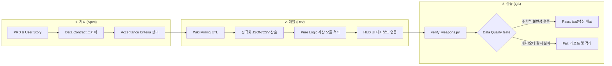

# Apex Engineering Sandbox
> **기획(Spec) ➔ 모듈 개발(Dev) ➔ 검증 자동화(QA) 전 주기를 실험하고 체계화하는 엔지니어링 샌드박스**

[](https://www.python.org/)
[](https://docs.pytest.org/)
[](https://pandas.pydata.org/)
[](#-3단계-엔지니어링-생명주기-core-lifecycle)

---

## 1. 프로젝트 성격 및 엔지니어링 서사 (Engineering Narrative)

본 프로젝트는 단순한 게임 스탯 뷰어나 토이 프로젝트가 아닙니다.  
**소프트웨어 아키텍처와 QA 엔지니어링 방법론을 결합하여, '기획 명세 정의'부터 '모듈형 코드베이스 개발', 그리고 '수학적 검증 오라클(Test Oracle)을 통한 데이터 품질 게이트'에 이르는 소프트웨어 전 주기를 1인 체계에서 엄격하게 실증하는 R&D 샌드박스**입니다.

### 핵심 설계 철학 (Core Philosophy)
1. **관심사의 엄격한 분리 (Separation of Concerns)**: 비즈니스 기획(Spec), 데이터 마이닝/수집(Dev), 무결성 검증(QA)의 역할을 물리적으로 분리하여 관리.
2. **Shift-Left 품질 보증**: 개발이 끝난 뒤 수동으로 버그를 찾는 것이 아니라, 기획 단계에서 Data Contract(JSON 스키마)와 물리 불변성(Invariants)을 사전 정의하여 결함을 원천 예방.
3. **재현 가능한 데이터 파이프라인**: 비정형 웹 데이터(Wiki)를 정형 데이터(CSV/JSON)로 가공하고, 교차 검증을 통과한 데이터만 프로덕션 레이어에 주입.

---

## 2. 3단계 엔지니어링 생명주기 (Core Lifecycle)



### [Stage 1. 기획 단계] Specification & Data Contract
- [PRD.md](docs/planning/PRD.md) 및 기능별 명세서(`01_weapons.md` ~ `04_tierlist.md`) 수립.
- 프론트엔드와 수집 파이프라인 간의 데이터 인터페이스 규격(JSON Schema) 확정.
- 단위 테스트 및 E2E 테스트를 위한 완료 기준(DoD / Acceptance Criteria) 수립.

### [Stage 2. 개발 단계] Modular Python Pipeline & Jamstack
- **크롤러 및 ETL (`scripts/apex_crawler.py`)**: `BeautifulSoup` 및 `requests`를 활용하여 공식 위키의 수치 데이터를 무손실 크롤링 및 파싱.
- **순수 함수 기반 계산 모듈 분리**: 방어구 티어 및 헬멧 감쇄율에 따른 TTK(Time-to-Kill) / DPS 연산 엔진을 UI와 완전히 격리 설계.
- **초경량 클라이언트 대시보드**: SPA 해시 라우팅, 실시간 필터링, 브라우저 캐시 버스팅(`?v=`)을 적용한 Jamstack 구조.

### [Stage 3. 검증 단계] Test Oracle & Physical Invariant Verification
- **수학적 불변성 검증 엔진 (`scripts/verify_weapons.py`)**:
  - 인게임 물리 법칙(Test Oracle)을 단정문(Assertion)으로 자동 검증:
    $$\text{Headshot Damage} \ge \text{Body Damage} \ge \text{Leg Damage}$$
    $$\text{DPS} \approx \frac{\text{Damage} \times \text{RPM}}{60} \quad (\text{허용 오차 } \pm 1.0)$$
  - 오타, 결측치, 음수 값, 비정상 배율 발생 시 즉각 파이프라인 차단.
- **실시간 패치 감지 및 교차 검증**: 공식 위키의 신규 밸런스 패치 데이터를 로컬 DB 및 구글 스프레드시트와 필드 단위로 Diff 대조하여 패치 내역 자동 감지.

---

## 3. 디렉토리 구조 (Directory Structure)

```
c:\Dev\Apex/
├── config/                   # 환경 설정 및 참조 URL 메타데이터
├── data/                     # 파이프라인 추출 정형 데이터 (JSON, CSV)
│   ├── weapons_data.json     # 검증 완료된 무기 스펙 마스터 데이터
│   └── weapons_data_refined.csv
├── docs/                     # 엔터프라이즈 문서 체계 (Documentation Hub)
│   ├── planning/             # [기획] PRD, 00_design_system, 기능별 명세서
│   ├── dev/                  # [개발] 아키텍처 개요, 데이터 파이프라인 명세
│   └── qa/                   # [검증] 무기 데이터 테스트 전략 및 품질 기준
├── scripts/                  # 파이썬 데이터 파이프라인 및 검증 엔진
│   ├── apex_crawler.py       # 공식 위키 스크레이퍼 및 ETL
│   ├── verify_weapons.py     # 수학적 불변성 검증 및 교차 검증기 (Test Oracle)
│   └── upload_to_sheets.py   # 구글 시트 단방향 동기화 모듈
├── src/                      # 프론트엔드 대시보드
│   ├── styles/               # Apex 시그니처 HUD 다크 테마 디자인 시스템
│   └── app.js                # SPA 해시 라우팅 및 무기 도감 필터 인터랙션
├── index.html                # 반응형 커맨드 센터 대시보드
├── requirements.txt          # Python 의존성
└── todo2.txt                 # 제품 마스터 로드맵 (Spec-Dev-QA 3-Stage)
```

---

## 4. 실행 및 검증 가이드 (Execution & Verification)

### 1) 환경 세팅
```bash
python -m venv .venv
source .venv/Scripts/activate    # Windows: .venv\Scripts\activate
pip install -r requirements.txt
```

### 2) 데이터 수집 및 정제 파이프라인 실행
```bash
python scripts/apex_crawler.py
```

### 3) 품질 게이트 (수학적 불변성 검증 엔진) 구동
```bash
python scripts/verify_weapons.py
```
```text
[실행 결과 예시]
[*] 31개 무기 데이터 로드 완료
[*] 물리 불변성 검증 (헤드 >= 바디 >= 다리): 100% PASS
[*] 수식 무결성 검증 (DPS ≈ 데미지 * RPM / 60): 100% PASS
[+] Quality Gate 통과: 프로덕션 배포 적합
```

---

## 5. 현재 구현 현황 및 로드맵 (Status & Roadmap)

| 단계 | 항목 | 상세 내용 | 상태 |
|---|---|---|:---:|
| **Phase 1** | **데이터 ETL 파이프라인** | 공식 위키 31종 총기 데이터 마이닝 및 정제 | **✅ 완료** |
| **Phase 1** | **품질 게이트 엔진** | `verify_weapons.py` 기반 수학적 불변성 자동 검증기 | **✅ 완료** |
| **Phase 2** | **무기 도감 대시보드** | SPA 해시 라우터, 탄약/클래스 필터링, 캐시 버스팅 | **✅ 완료** |
| **Phase 3** | **TTK/DPS 정밀 계산기** | 방어구/헬멧 티어별 순수 연산 모듈 및 인터랙티브 UI | 🔄 진행 중 |
| **Phase 4** | **API 정합성 테스트 자동화**| Pytest 기반 크롤러 및 데이터 스키마 자동화 테스트 파이프라인 | ⏳ 예정 |
| **Phase 5** | **실시간 라이브 API 연동** | ALS Open API 기반 맵 로테이션 및 랭크 컷오프 연동 | ⏳ 예정 |
